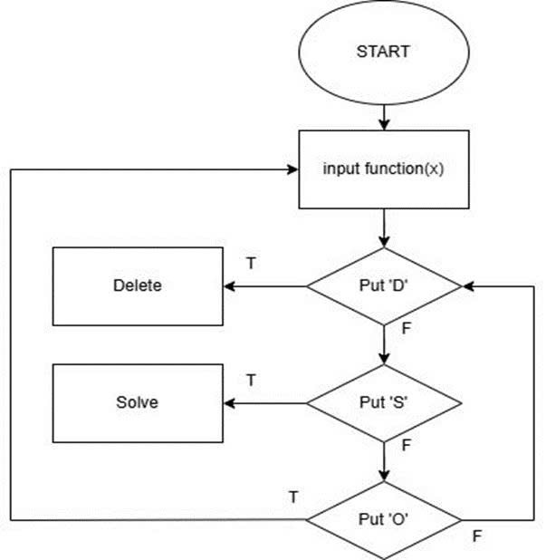
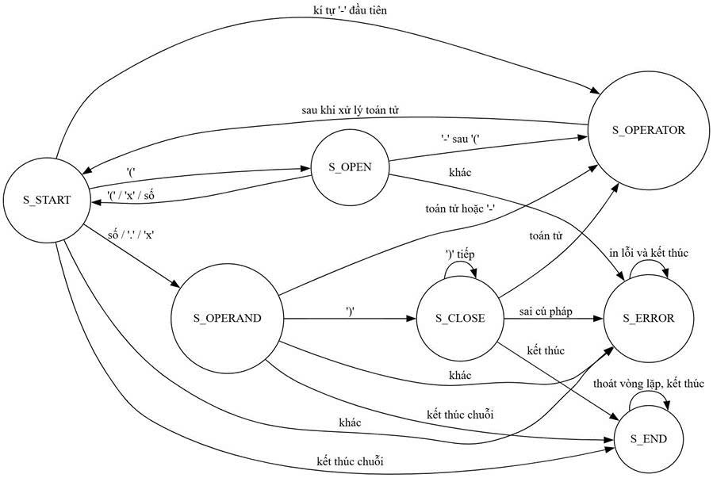
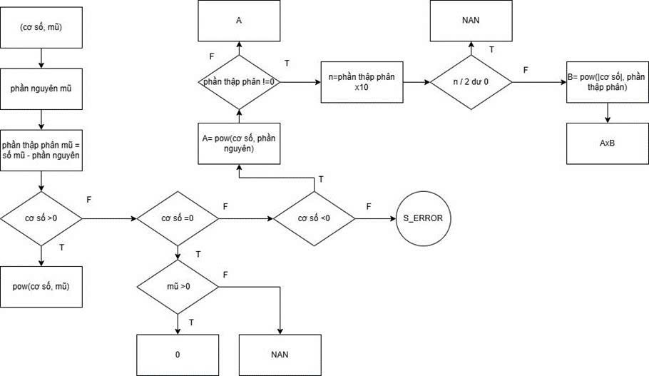
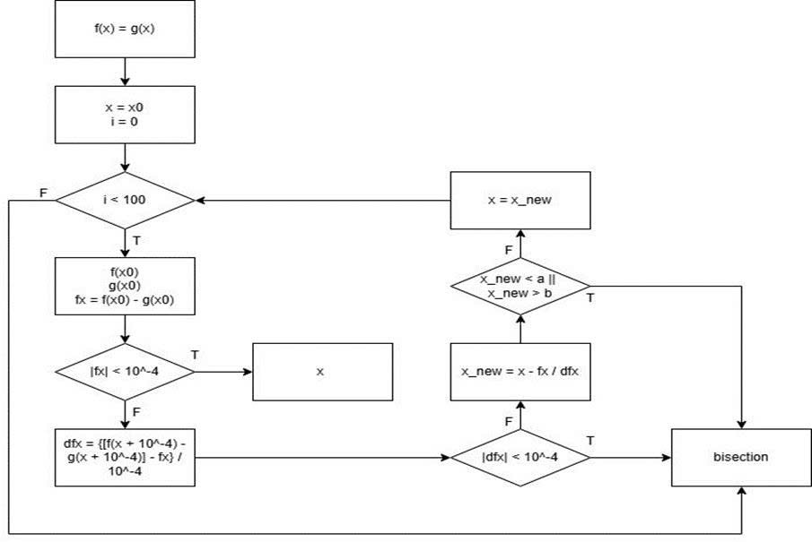
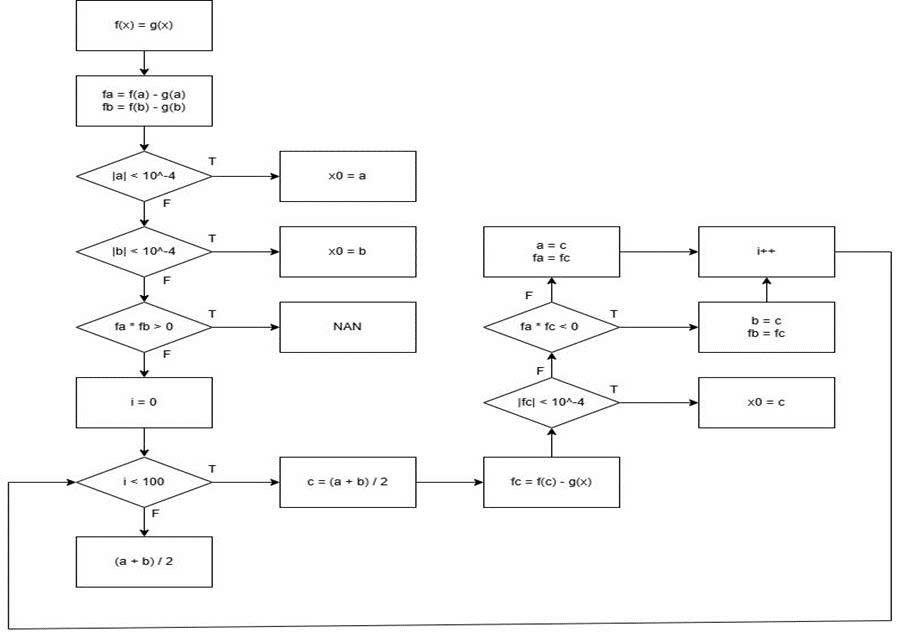
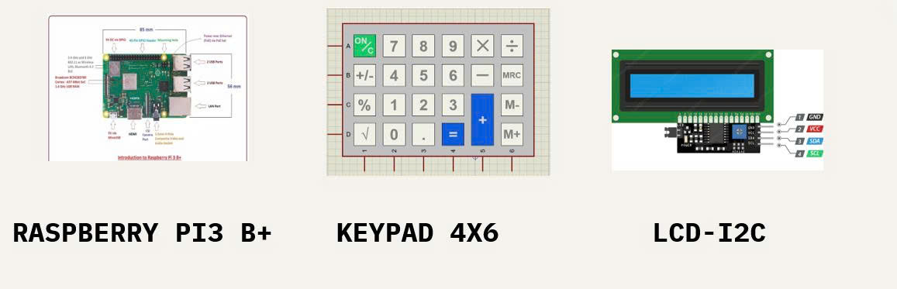

# 🧮 Casio-by-RASP: Equation Solver on Raspberry Pi 3B+

## 📌 Introduction
This project implements a **real-time equation solver** on **Raspberry Pi 3 Model B+**, designed to find solutions of nonlinear equations using **Newton–Raphson** and **Bisection** methods.  
The system combines the **speed of Newton–Raphson** with the **stability of Bisection** to ensure both efficiency and reliability.  

---

## 🔧 Features
- Accepts equation input via **4x6 keypad**.  
- Displays results on an **I2C LCD**.  
- Applies **Newton-Raphson** when stable for fast convergence.  
- Falls back to **Bisection method** when Newton-Raphson becomes unstable.  
- User-friendly interface similar to a calculator.  

---

## 🖼️ System Diagrams
### Algorithm Flow
| Diagram 1 | Diagram 2 | Diagram 3 |
|-----------|-----------|-----------|
|  |  |  |

| Diagram 4 | Diagram 5 |
|-----------|-----------|
|  |  |

---

## ⚙️ Components
- Raspberry Pi 3B+  
- LCD with I2C interface  
- 4x6 Keypad  
- Supporting power supply and connection wiring  

---

## 🧮 Methods Used
### Newton-Raphson
- Fast convergence with derivative-based iteration.  
- Risk of divergence when derivative ≈ 0.  

### Bisection
- Always converges if function changes sign in interval.  
- Slower compared to Newton-Raphson.  

### Hybrid Strategy
- Start with **Newton-Raphson** for speed.  
- If instability detected → switch to **Bisection** for guaranteed solution.  

---

## ✅ Results
- Verified correct solutions for various test equations.  
- Achieved balance: **fast execution** + **stable convergence**.  
- Usability comparable to Casio scientific calculators.  

---

## 👨‍💻 Team Members
- Nguyễn Minh Thành  
- Nguyễn Duy Đông  
- Lê Minh Đức  
- Bùi Minh Quân  

---

## 📫 Contact
✉️ For more details: **nguyenminhthanh.offfice@gmail.com**
